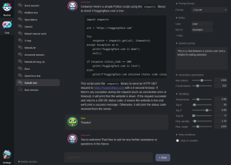
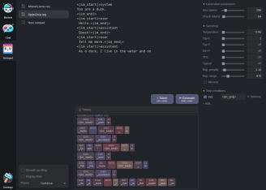
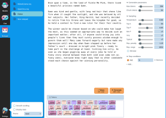

<p align="center">

# ExUI

This is a simple, lightweight browser-based UI for running local inference using [ExLlamaV2](https://github.com/turboderp/exllamav2).

### Overview of features

- Friendly, responsive and minimalistic UI
- Persistent sessions
- Multiple instruct formats
- Speculative decoding
- Supports EXL2, GPTQ and FP16 models
- Notepad mode

### Screenshots

[](doc/screenshot_1.png)
[](doc/screenshot_2.png)
[](doc/screenshot_3.png)
[](doc/screenshot_4.png)
[](doc/screenshot_5.png)
[](doc/screenshot_6.png)
[](doc/screenshot_7.png)
[](doc/screenshot_8.png)

### Running locally

First, clone this repository and install requirements:

```
git clone https://github.com/turboderp/exui
cd exui
pip install -r requirements.txt
```

Optionally, install javascript modules locally, to enable the UI to run when offline (requires Node and npm to be installed):
```
cd static
npm install
cd ..
```

Then run the web server with the included server.py:

```
python server.py
```

Your browser should automatically open on the default IP/port. Config and sessions are stored in `~/exui` by default.

Prebuilt wheels for ExLlamaV2 are available [here](https://github.com/turboderp/exllamav2/releases). Installing 
the latest version of [Flash Attention](https://github.com/Dao-AILab/flash-attention) is recommended.

### Running in Google Colab

An example Colab notebook is provided [here](https://github.com/turboderp/exui/blob/master/doc/colab.ipynb).

### Installation

More detailed installation instructions can be found [here](https://github.com/turboderp/exui/blob/master/doc/manual-install.md).

### More to come

Stay tuned.


